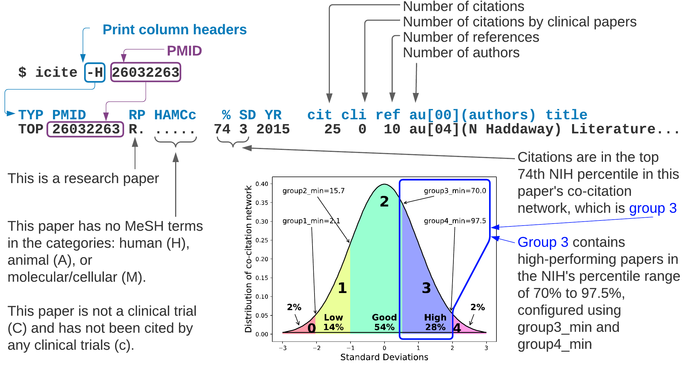

# CHANGELOG

## Summary

* [**Unreleased**](#unreleased)
* [**Release 2022-03-24 v0.0.30**](#release-2022-03-24-v0030) Adjust intro paragraph so search engines don't write a summary with missing spaces
* [**Release 2022-01-17 v0.0.29**](#release-2022-01-17-v0029) Add summary image to README/index.md
* [**Release 2021-10-11 v0.0.28**](#release-2021-10-11-v0028) Add summary image to README/index.md
* [**Release 2021-10-07 v0.0.27**](#release-2021-10-07-v0027) Minor cleanup text format in README/index.md
* [**Release 2021-10-07 v0.0.26**](#release-2021-10-07-v0026) Add link to paper in journal, Research Synthesis Methods
* [**Release 2021-10-07 v0.0.25**](#release-2021-10-07-v0025) Add link to journal, Research Synthesis Methods
* [**Release 2021-10-07 v0.0.24**](#release-2021-10-07-v0024) README text succinct and clean. Add twitter button.
* [**Release 2021-10-02 v0.0.23**](#release-2021-10-02-v0023) Use external link for gh-page images
* [**Release 2021-09-26 v0.0.20**](#release-2021-09-26-v0020) Improved speed for downloading PMIDs returned from a PubMed query
* [**Release 2021-09-18 v0.0.19**](#release-2021-09-18-v0019) Added CITATION.cff and Google Search Console tag
* [**Release 2021-09-05 v0.0.18**](#release-2021-09-05-v0018)
  * 4x speed improvement when downloading papers, citations, and references; removed `PubMedQueryToICite` arg `prt_icitepy`
* [**Release 2021-09-03 v0.0.17**](#release-2021-09-03-v0017)
  Added "online-always" mode to download the latest NIH citation data three times as fast as the original "online/offline" mode
* [**Release 2021-08-22 v0.0.16**](#release-2021-08-22-v0016)
  Corrected: [AttributeError: 'NoneType' object has no attribute 'pmid' #4](https://github.com/dvklopfenstein/pmidcite/issues/4)
* [**Release 2021-08-14 v0.0.15**](#release-2021-08-14-v0015) Simplify code by instantiating NIHiCiteDownloader directly
* [**Release 2021-08-08 v0.0.14**](#release-2021-08-08-v0014) Simplified NIH downloader interface. Improved speed handling large numbers of PMIDs
* [**Release 2021-08-03 v0.0.12**](#release-2021-08-03-v0012)
	* Add new `icite` arguments, `-c` and `-r` for finer grain control for downloading NIH citation data
	* Add new `icite` arguments, `-c` and `-r` for finer grain control for downloading NIH citation data
  [#3](https://github.com/dvklopfenstein/pmidcite/issues/3)
* [**Release 2021-07-12 v0.0.10**](#release-2021-07-12-v009) Updated notebooks to use new customizable paper grouping [#2](https://github.com/dvklopfenstein/pmidcite/issues/2)
* [**Release 2021-07-06 v0.0.8**](#release-2021-07-06-v008) Made grouping of paper's customizable
* [**Release 2020-12-03 v0.0.5**](#release-2020-12-03-v005) The 1st citation count in icite line contains any clinical citations
* [**Release 2020-12-02 v0.0.4**](#release-2020-12-02-v004) Added to Documentation in README andd convenience get functions

## Details

### Unreleased

### Release 2022-03-24 v0.0.30
ADDED:
* What is pmid2cite doing with your data and who are they?
* More comments regarding Google Scholar
* Improve link format in README.md
* Clearly say NIH is the National Institutes of Health

CHANGED:
* Improved error message from API

### Release 2022-01-17 v0.0.29
$ gitlog --since 2022-10
RAN: git log --after "2022-10" --pretty=format:"%Cred%H %h %an %cd%Creset %s" --name-status

All STARTING ON: 2022_01_16 Sun - 6 commits, 4 files
  Sun 2022-01-16 18:57:25 4cbb911 A like -> such as
  Mon 2022-01-17 06:56:50 f1e7ead B Cite/ref arrows right-to-left
  Mon 2022-01-17 07:12:29 c7563cc C rm comment
  Mon 2022-01-17 07:15:19 62943b0 D Group 4 (top group) color like in gaussian curve plot
  Mon 2022-01-17 07:26:37 8b496ef E Add contact
  Mon 2022-01-17 07:28:23 7b39acb F Format
    A...EF M README.md
    .B.D.. M docs/images/pmidcite_summary.png
    ..C... M src/bin/plt_guassian_nihperc.py
    ...D.. M doc/images/nih_perc_groups.png
6 commits since 2022_01_16 shown

### Release 2021-10-11 v0.0.28
* Add summary image to README/index.md

### Release 2021-10-07 v0.0.27
* Minor cleanup text format in README/index.md

### Release 2021-10-07 v0.0.26
* Add link to paper in journal, Research Synthesis Methods

### Release 2021-10-07 v0.0.25
* Add link to journal, Research Synthesis Methods in README.md and docs/index.md

### Release 2021-10-07 v0.0.24
* Top of README more clean and succinct
* Add twitter badge and link

### Release 2021-10-02 v0.0.23
* Use external link for gh-page images so they are viewable from PyPi page
* Improve utility of function by returning a list of namedtuples instead of None

### Release 2021-09-26 v0.0.20
* Massive speed increase of downloading PMIDs returned from a PubMed query by downloading 1,000 PMIDs at a time  #81a6cd8 #e04a7c5

### Release 2021-09-18 v0.0.19
* Add CITATION.cff file
* Added Google Search Console tag 
* Changed: minor updates, including:
  * Return [] if there are no authors #e294100

### Release 2021-09-05 v0.0.18
* Improve speed by 4x for "online-only" mode when downloading citation data for multiple papers and their citations and/or references
* Remove obsolete argument, `prt_icitepy`, of `PubMedQueryToICite`
* If an NIH citations contains no authors, use an empty list (e.g. [])  # git show e2941007b67fb8aae3ce861da7013a97811b6dcc (src/pmidcite/icite/api.py)

### Release 2021-09-03 v0.0.17
Changes for [Issue #5](https://github.com/dvklopfenstein/pmidcite/issues/5):
* Added "online-always" mode to download the latest NIH citation data three times as fast as the original "online/offline" mode
* Made "online-always" mode the default
* Moved "online/offline" mode to be an option

### Release 2021-08-22 v0.0.16
* Corrected: [AttributeError: 'NoneType' object has no attribute 'pmid' #4](https://github.com/dvklopfenstein/pmidcite/issues/4)

### Release 2021-08-14 v0.0.15
* Simplify code by instantiating NIHiCiteDownloader directly

### Release 2021-08-08 v0.0.14
* Simplified the pmidcite library interface [Notebook updates](https://github.com/dvklopfenstein/pmidcite/issues/2#issuecomment-894760798)
* Improved speed for downloading/loading NIH citation data for large (e.g. greater than 80,000) sets of PMIDs

### Release 2021-08-03 v0.0.12
* NIH citation data is now downloaded for only researcher-specified PMIDs by default. [#3](https://github.com/dvklopfenstein/pmidcite/issues/3)
* To download NIH citation details for citations/references of a researcher-specified PMID, use the icite arguments:
  * -v (download NIH citation details for both citations and references of a researcher-specified PMID)
  * -c (download NIH citation details for the citations of a researcher-specified PMID)
  * -r (download NIH citation details for the references of a researcher-specified PMID)

### Release 2021-07-13 v0.0.10
* Add script, icite (like icite.py)

### Release 2021-07-12 v0.0.9
* Updated all notebooks to use the new customizable paper grouping using the NIH's co-citation network data [#2](https://github.com/dvklopfenstein/pmidcite/issues/2)

### Release 2021-07-16 v0.0.8
* Made grouping of papers customizable by the researcher
* Added image showing how to read the output of icite

### Release 2020-12-03 v0.0.5
* The 1st citation count in icite line contains any clinical citations

### Release 2020-12-02 v0.0.4
* Improved documentation in README
* Added notes about an external pmid2cite Web application
* Minor code improvements: Added get functions for researchers using pmidcite as a library

Copyright (C) 2019-present, DV Klopfenstein. All rights reserved.
