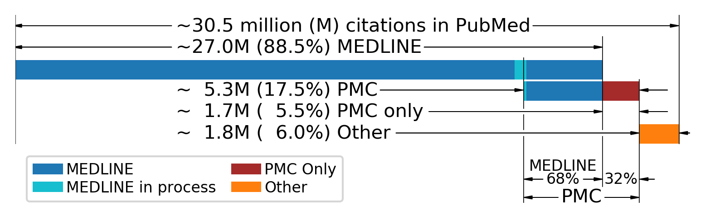

# [PubMed](https://pubmed.ncbi.nlm.nih.gov) ID (PMID) Cite
Augment your PubMed literature search 
from the command-line by linking citation
data downloaded from [**NIH's Open Citation Collection (NIH-OCC), iCite**](https://icite.od.nih.gov)
with [**PubMed**](https://pubmed.ncbi.nlm.nih.gov) IDs (PMIDs),
rather than clicking and clicking and clicking on
[**Google Scholar**](/doc/images/README.md#google-scholar)
*Cited by N* links.

* ***pmidcite***:
  * [**Installation**](#installation)
  * [**Setup**](#setup)
  * [**How to cite**](#how-to-cite)
* [***pmidcite*, on the command line**](#command-line-interface-cli):
  * [**1) Get citation counts, given PMIDs**](#1-get-citation-counts-given-pmids)
  * [**2) Sort citation counts, given PMIDs**](#2-sort-citation-counts-given-pmids)
  * [**3) Query PubMed and download the citation data**](#3-query-pubmed-and-download-the-citation-data)
  * [**4) Get citation data for PMIDs listed in a file**](#4-get-citation-data-using-pmids-downloaded-from-pubmed)
  * [**5) Create ASCII plots**](#5-create-ascii-plots)
* ***pmidcite*, the Python library**
  * [**1) Download NIH-OCC citation data**](https://github.com/dvklopfenstein/pmidcite/blob/main/notebooks/NIHOCC_data_download_always.ipynb)
  * [**2) Download missing or load existing NIH-OCC citation data**](https://github.com/dvklopfenstein/pmidcite/blob/main/notebooks/NIHOCC_data_download_or_import.ipynb)
  * [**3) Print a paper's citation and reference data**](https://github.com/dvklopfenstein/pmidcite/blob/main/notebooks/print_paper_all_refs_cites.ipynb)
  * [**4) Sort NIH iCite entries**](https://github.com/dvklopfenstein/pmidcite/blob/main/notebooks/print_paper_sort_cites.ipynb)
  * [**5) Query PubMed**](https://github.com/dvklopfenstein/pmidcite/blob/main/notebooks/query_pubmed.ipynb)
* [**PubMed vs Google Scholar**](#pubmed-vs-google-scholar-gs)
* [**What is in PubMed?**](#what-is-in-pubmed)

## Command Line Interface (CLI)

A Command-Line Interface (CLI) can be preferable 
to a Graphical User Interface (GUI) because: 
processing can be automated from a script;
time-consuming mouse clicking is reduced; and
more data can be seen at once on a text screen
than in a browser, giving the researcher 
a better overall impression of the full set of information [1].

Linux and Mac users already work from the command line.
Windows users can get that Linux-like command line feeling
while still running native Windows programs by
downloading Cygwin from https://www.cygwin.com/ [1].

### 1) Get citation counts, given PMIDs
Quickly get the number of citations for a research paper with PMID, 26032263:
```
$ icite 26032263 -H
TYP PMID     RP HAMCc   % SD YR   cit cli ref au[00](authors) title
TOP 26032263 R. .....  68 2 2015    16  0  10 au[04](N R Haddaway) Making literature reviews more reliable through application of lessons from systematic reviews.
```
* The first line (`TYP PMID ...`) contains the column headers (`-H`).    
* The second line (`TOP ...`) is the citation data from NIH's iCite database.    
* The citation count, `16`, is under the `cit` column header.    

The [**group number**](#citation-group-numbers), `2` (`SD` column) indicates that the paper has a good citation rate,
specifically it is in the `68th` percentile (`%` column) compared to its peers.

#### Get the key for the column headers
```
$ icite -k

KEYS TO PAPER LINE:
    TYP PubMedID RP HAMCc % SD YEAR x y z au[A](First Author) Title of paper

TYPe of relationship to the user-requested paper (TYP):
    TOP: A user-requested paper
    CIT: A paper that cited TOP
    CLI: A clinical paper that cited TOP
    REF: A paper referenced in the TOP paper's bibliography

NIH iCite details:

  PubMedID: PubMed ID (PMID)

     RP section:
     ----------------------------------
         R: Is a research article
         P: iCite has calculated an initial Relative Citation Ratio (RCR) for new papers

     HAMCc section:
     ----------------------------------
         H: Has MeSH terms in the human category
         A: Has MeSH terms in the animal category
         M: Has MeSH terms in the molecular/cellular biology category
         C: Is a clinical trial, study, or guideline
         c: Is cited by a clinical trial, study, or guideline

     NIH section, based on Relative Citation Ratio (RCR):
     ----------------------------------
         %: NIH citation percentile rounded to an integer. -1 means "not determined" or TBD
        SD: NIH citation percentile group: 0=-3SD 1=-2SD 2=+/-1SD 3=+2SD 4=+3SD or i=TBD

     YEAR/citations/references section:
     ----------------------------------
      YEAR: The year the article was published
         x: Number of unique articles that have cited the paper
         y: Number of unique clinical articles that have cited the paper
         z: Number of references
     au[A]: A is the number of authors
```
#### Citation group numbers
The ***pmidcite*** citation rate group numbers, **0, 1, 2, 3,** and **4** (`SD` column), 
are determined using the *NIH Relative Citation Rate (RCR)* [5] percentile.
If the NIH has not yet determined a citation rate for new papers,
the ***pmidcite*** group number is **i** [1].


### 2) Sort citation counts, given PMIDs
Sort the citations (`CIT`) of the paper with PMID `26032263` first by citation group (`2` and `i`), then by year.

The citation group shown contains:
  * `i` New paper and not yet rated. The `i` variable will be set at a later date
  * `2` These papers are performing well

Sort options:
  * `-k6`: sort starting with the 6th column containing citation group, then by all text to the right.
  * `-r`: reverse the sort so the newest papers are at the top

```
$ icite 26032263 -v | grep CIT | sort -k6 -r
CIT 32557171 .. H....  -1 i 2020     0  0  21 au[05](Jillian Knox) Usage, definition, and measurement of coexistence, tolerance and acceptance in wildlife conservation research in Africa.
CIT 32317639 R. HA...  -1 i 2020     0  0   8 au[09](Trevor J Krabbenhoft) FiCli, the Fish and Climate Change Database, informs climate adaptation and management for freshwater fishes.
CIT 30285277 R. .....  -1 i 2019     2  0  14 au[02](Neal R Haddaway) Predicting the time needed for environmental systematic reviews and systematic maps.
CIT 30055022 .. HA...  -1 i 2019     1  0  12 au[04](Hillary Smith) Hunting for common ground between wildlife governance and commons scholarship.
CIT 31598307 R. HA...  -1 i 2019     1  0  12 au[02](Igor Khorozyan) How long do anti-predator interventions remain effective? Patterns, thresholds and uncertainty.
CIT 31024221 R. .....  -1 i 2019     0  0   7 au[02](Micah G Bennett) MEASURING LOTIC ECOSYSTEM RESPONSES TO NUTRIENTS: A Mismatch that Limits the Synthesis and Application of Experimental Studies to Management.
CIT 29488217 .P .A...  76 2 2018     7  0  64 au[03](Nicole V Coggan) A global database and 'state of the field' review of research into ecosystem engineering by land animals.
CIT 29514874 .P .A...  47 2 2018     3  0  38 au[02](Kelly D Hannan) Aquatic acidification: a mechanism underpinning maintained oxygen transport and performance in fish experiencing elevated carbon dioxide conditions.
CIT 28642071 .. H....  75 2 2017    11  0  80 au[05](Ora Oudgenoeg-Paz) The link between motor and cognitive development in children born preterm and/or with low birth weight: A review of current evidence.
CIT 28061344 R. .....  70 2 2017     8  0  54 au[03](Maria Cristina Mangano) Monitoring of persistent organic pollutants in the polar regions: knowledge gaps &amp; gluts through evidence mapping.
CIT 28042667 R. H....  53 2 2017     8  0  20 au[02](Martin J Westgate) The difficulties of systematic reviews.
CIT 29451529 .. H....  56 2 2016     9  0  20 au[01](Jennifer A Byrne) Improving the peer review of narrative literature reviews.
CIT 26984257 R. .....  46 2 2016     9  0   9 au[04](Neal R Haddaway) The benefits of systematic mapping to evidence-based environmental management.
CIT 27617203 .. .....  43 2 2016     5  0  40 au[02](Neal R Haddaway) On the benefits of systematic reviews for wildlife parasitology.
```

#### Other sort examples
We suggest starting with the `-k6` sort option because in 2018 Fiorini et al., the creaters of PubMed's "best match" relevance sort ordering in PubMed,
found that the most important document features to feed into the PubMed sorting algorithm are publication year and past usage.

Using the `-k6` argument to `sort` the citation group (usage group) does two things:
  * First, it highlightis the newest or best performing papers by putting them at the beginning, while getting the lowest performing papers out of the mix by placing them at the end.
  * Second, it shows the newest papers first in each usage group, highlighting them profoundly.

We chose to highlight using usage group first, rather than NIH RCR percentile in the 5th colum, seen with values `-1`, `76`, etc. because 
only seeing the best performing papers first might bias the paper chosen for further examination 
to only the best performing papers regardless of publication year.


### 3) Query PubMed and download the citation data
Query PubMed and download the citation data from the script, `src/bin/dnld_pmids.py`.    
**NOTE:** Copy `dnld_pmids.py` to your project repo. Don't modify the pmidcite repo.

#### 1. Add your query to your `dnld_pmids.py` script
```
    queries = [
        # Output filename     PubMed query
        # -----------------  -----------------------------------
        ('killer_whale.txt', 'Orcinus Orca Type D'),
    ]
```

#### 2. Run the script
```
$ src/bin/dnld_pmids.py
     3 IDs FOR pubmed QUERY(Orcinus Orca Type D)
     3 WROTE: ./log/pmids/Orcinus_Orca_Type_D.txt
     3 WROTE: ./log/icite/Orcinus_Orca_Type_D.txt
```

#### 3. Examine the citation and pubmed data, sorting by year (column 7; `-k7`)
```
$ grep TOP ./log/icite/Orcinus_Orca_Type_D.txt | sort -k7
TOP 20050301 R. .A...  70 2 2009    43  0  25 au[05](Andrew D Foote) Ecological, morphological and genetic divergence of sympatric North Atlantic killer whale populations.
TOP 22882545 .. .A...  63 2 2013    25  0  24 au[03](P J N de Bruyn) Killer whale ecotypes: is there a global model?
TOP 31461780 R. .A...  -1 i 2020     0  0   0 au[06](Robert L Pitman) Enigmatic megafauna: type D killer whale in the Southern Ocean.
```

#### 4) Get citation data using PMIDs downloaded from PubMed
Note that the PubMed query using NIH E-Utils from the `dnld_pmids.py` script
will often be slightly different than the query run on the PubMed website.
PubMed has been alerted.

Consequently, you may also want to view citation data on PMID PubMed query results
downloaded from the PubMed website into a file like `pmid-OrcinusOrc-set.txt`:    
*Save->All results, Format=PMID*
```
$ icite -i pmid-OrcinusOrc-set.txt
TOP 30123694 RP HA...  17 2 2018     1  0   6 au[07](Paul Tixier) Killer whale (<i>Orcinus orca</i>) interactions with blue-eye trevalla (<i>Hyperoglyphe antarctica</i>) longline fisheries.
TOP 31461780 R. .A...  -1 i 2020     0  0   0 au[06](Robert L Pitman) Enigmatic megafauna: type D killer whale in the Southern Ocean.
TOP 22882545 .. .A...  63 2 2013    25  0  24 au[03](P J N de Bruyn) Killer whale ecotypes: is there a global model?
TOP 20050301 R. .A...  70 2 2009    43  0  25 au[05](Andrew D Foote) Ecological, morphological and genetic divergence of sympatric North Atlantic killer whale populations.
```


### 5) Create ASCII plots
Create a scatter plot of publication year vs. citation count for a list of papers.
This will be made more user friendly.

Columns 7 and 8 contain the year and the citation count.
```
$ grep TOP log/icite/Osbourn_Anne.txt | awk '{print $7 " " $8}' | scatter.py
-------------------------------------------------------------------------------------------- 282
|                                                                1                         |
|                                                                                          |
|                                                                                          |
|                                                                                          |
|                                                                                          |
|                                                                                          |
|                                                                                          |
|                                                                                          |
|                              1                                                           |
|                                                                                          |
|               1                                                                          |
|                                                                                          |
|                                                                                          |
|                                                           1                              |
|          1                                                     1                         |
|1                                  1                                                      |
|                                                                                          |
|                                                      1                                   |
|                    1                   1                                                 |
|                                            1                   1                         |
|                                            1              1    1                         |
|     1                             1                                 1                    |
|                    1              1                  1    1                              |
|                              1             1              1                              |
|     1              1              1    1        2    2                                   |
|                                        1                            1    2               |
|                                                           1    2    1    1         1     |
|1    1                                  1   2    1    1              3    1    4          |
|               1         1    1         1   1    3    1    1    1              5          |
|          2         2                                           1    1    2    1    7    3|
-------------------------------------------------------------------------------------------- 0
2002                                                                                          2020
```


## Installation
```pip install pmidcite```

## Setup
Save your literature search in a GitHub repo.

### 1. Add a pmidcite init file
Add a .pmidciterc init file to a non-git managed directory, like home (~)
```
$ icite --generate-rcfile | tee ~/.pmidciterc
[pmidcite]
email = name@email.edu
apikey = long_hex_digit
tool = scripts
dir_icite_py = .
dir_pubmed_txt = .
dir_pmids = .
dir_icite = .
```

```
$ export PMIDCITECONF=~/.pmidciterc
```
You will want `.pmidciterc` to **not** be managed by GitHub because it
will contain your personal email and your private NCBI API key.

### 2. Add directories
Add directories which match those in ~/.pmidciterc:
```
$ mkdir [GIT_REPO_PATH]/icite
$ mkdir [GIT_REPO_PATH]/log
$ mkdir [GIT_REPO_PATH]/log/pubmed
$ mkdir [GIT_REPO_PATH]/log/pmids
$ mkdir [GIT_REPO_PATH]/log/icite
```

### 3. NCBI E-Utils API key
If you want to download PubMed abstracts and PubMed search results using NCBI's E-Utils,
get an NCBI API key using these instructions:    
https://ncbiinsights.ncbi.nlm.nih.gov/2017/11/02/new-api-keys-for-the-e-utilities

Set the `apikey` value in the config file: `~/.pmidciterc`


## PubMed vs Google Scholar (GS)
<p align="center">

</p>

### PubMed implements all five Boeker critera[1]:

In late October 2013, Boeker et al. recommended
that a scientific search interface contain
five integrated search criteria. 
The 2013 Boeker guidance greatly influenced the Gusenbauer study [3],
which expanded the Boeker list from five search criteria to twenty-seven
for their study of twenty-eight search tools.

The requirements for search interfaces are mandatory not only for structured scientific literature retrieval like systematic reviews, but also in any research that needs to provide a comprehensive literature review [6]. 
We add "Forward citation search" to the Boeker list
to evaluate the extremely popular GS implementation of this feature
against the PubMed implementation
and compare PubMed and GS's support for the search tools below
using the 2013 foundational Boeker advice [6].


## What is in PubMed?


### PubMed indexes about 30.5 million documents [1]:

PubMed is a search interface and toolset used to access databases like
MEDLINE and PubMed Central (PMC) as well as additional content
like books and articles published before the 1960s.
Over 30.5 million article records are accessible through the PubMed interface.
The databases, MEDLINE and PMC, are separate entities whose combined articles
comprise 94% of all of the coverage indexed by PubMed ([1] S2).
MEDLINE is a highly selective database started in the 1960s.
PMC, started in 2000, is an open-access database for full-text papers that are free of cost to the reader.

Take a [**quick tour**](https://www.nlm.nih.gov/pubs/techbull/ma20/brief/ma20_pubmed_essentials.html) of [**PubMed**](https://pubmed.ncbi.nlm.nih.gov) 


## How to Cite

_If you use **pmidcite** in your literature search, please cite the following two papers_:

1. [**Commentary to Gusenbauer and Haddaway 2020: Evaluating Retrieval Qualities of PubMed and Google Scholar**](???)    
Klopfenstein DV and Dampier W    
2020 | _Research Synthesis Methods_ | PMID: *Coming soon* | [DOI: *Coming soon*]()

2. [**The NIH Open Citation Collection: A public access, broad coverage resource**](https://pubmed.ncbi.nlm.nih.gov/31600197/)    
Hutchins BI ... Santangelo GM    
2019 | _PLoS Biology_ | PMID: [31600197](https://pubmed.ncbi.nlm.nih.gov/31600197) | [DOI: 10.1371/journal.pbio.3000385](https://journals.plos.org/plosbiology/article?id=10.1371/journal.pbio.3000385)    

_And please consider reading and citing the paper [3] which inspired the creation of **pmidcite** and their response to our paper [4]_:

3. [**Which Academic Search Systems are Suitable for Systematic Reviews or Meta-Analyses? Evaluating Retrieval Qualities of Google Scholar, PubMed and 26 other Resources**](https://pubmed.ncbi.nlm.nih.gov/31614060/)    
Gusenbauer M and Haddaway N    
2019 | _Research Synthesis Methods_ | PMID: [31614060](https://pubmed.ncbi.nlm.nih.gov/31614060) | [DOI:10.1002/jrsm.1378](https://onlinelibrary.wiley.com/doi/full/10.1002/jrsm.1378)

4. [**What every Researcher should know about Searching – Clarified Concepts, Search Advice, and an Agenda to improve Finding in Academia**](???)    
Gusenbauer M and Haddaway N    
2020 | _Research Synthesis Methods_ | PMID: *Coming soon* | [DOI: *Coming soom*]()

_Mentioned in this README are also these outstanding papers_:

5. [**Relative Citation Ratio (RCR): A New Metric That Uses Citation Rates to Measure Influence at the Article Level**](https://pubmed.ncbi.nlm.nih.gov/27599104/)    
Hutchins BI, Xin Yuan, Anderson JM, and Santangelo, George M.    
2016 | _PLoS Biology_ | PMID: [27599104](https://pubmed.ncbi.nlm.nih.gov/27599104) | [DOI: 10.1371/journal.pbio.1002541](https://journals.plos.org/plosbiology/article?id=10.1371/journal.pbio.1002541)

6. [**Google Scholar as replacement for systematic literature searches: good relative recall and precision are not enough**](https://pubmed.ncbi.nlm.nih.gov/24160679/)    
Boeker M et al.    
2013 | BMC Medical Research Methodology | PMID: [24160679](https://pubmed.ncbi.nlm.nih.gov/24160679) | [DOI:10.1186/1471-2288-13-131](https://bmcmedresmethodol.biomedcentral.com/articles/10.1186/1471-2288-13-131)


Copyright (C) 2019-present, DV Klopfenstein. All rights reserved.
