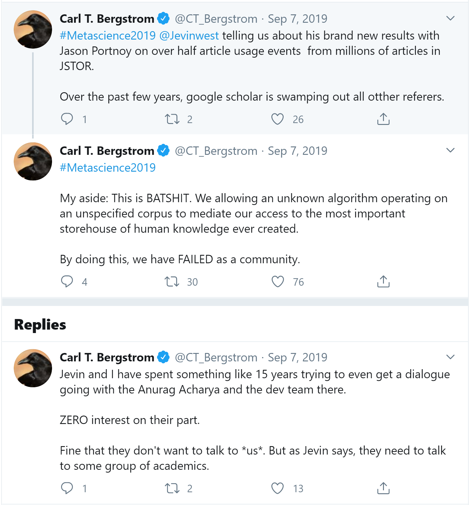
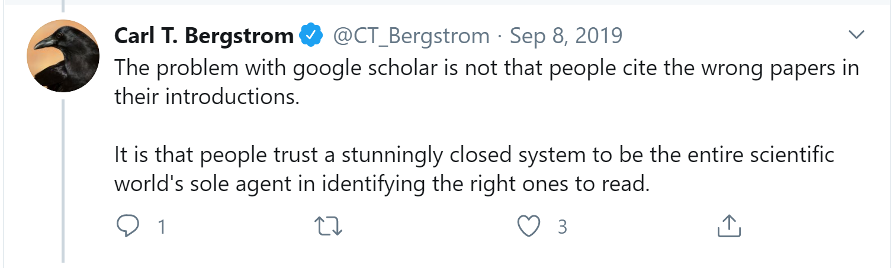
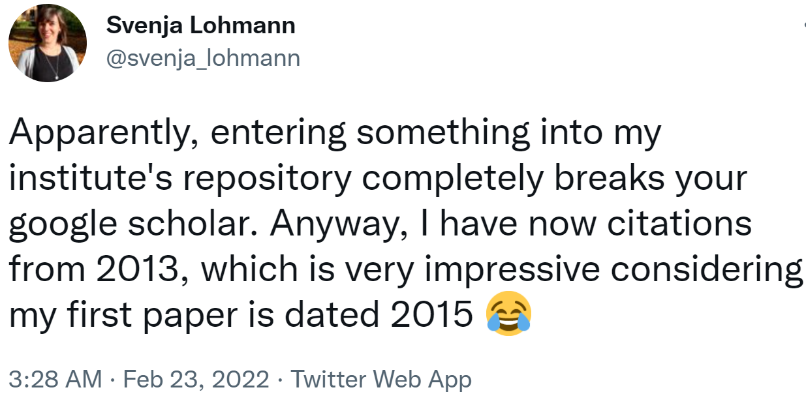
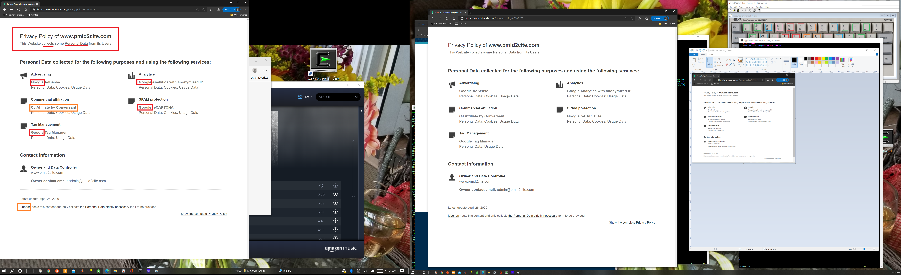

# Out in the field

* [Comments regarding Google Scholar](#comments-regarding-google-scholar)
  * [Unknown algorithm operating on an unspecified corpus of the most important storehouse of knowledge](#unknown-algorithm-operating-on-an-unspecified-corpus-of-the-most-important-storehouse-of-knowledge)
  * [2013 Google citations for 2015 work](#2013-google-citations-for-2015-work)
* [Who is running pmid2cite.com?](#who-created-pmid2citecom)

## Comments regarding Google Scholar
### Unknown algorithm operating on an unspecified corpus of the most important storehouse of knowledge
https://twitter.com/CT_Bergstrom/status/1170465764832231427    
     
    
### 2013 Google citations for 2015 work
https://twitter.com/svenja_lohmann/status/1496401646364024835    

## Who created pmid2cite.com?
**What are the doing with your data?**    

https://www.pmid2cite.com/ looks useful for non-CLI (Command Line Interface) researchers,
but it is unclear who created it.

There is no "About Us" or "Our Team" section.
And when you click on the [privacy policy](https://www.iubenda.com/privacy-policy/87688178), this appears:

Copyright (C) 2020-present, DV Klopfenstein. All rights reserved.
