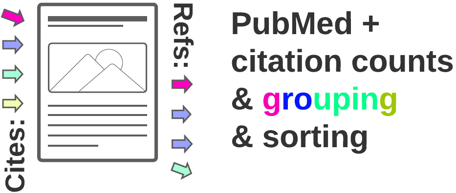
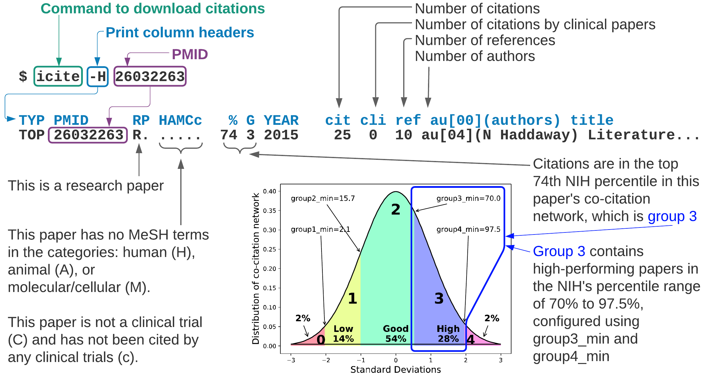
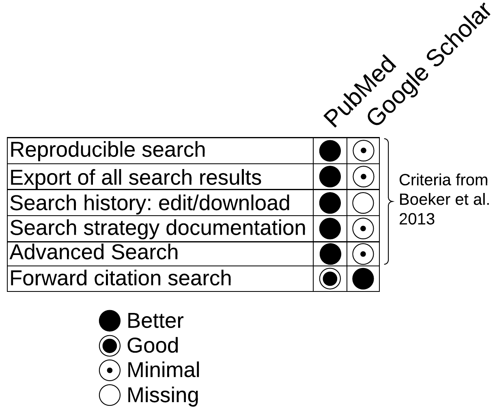
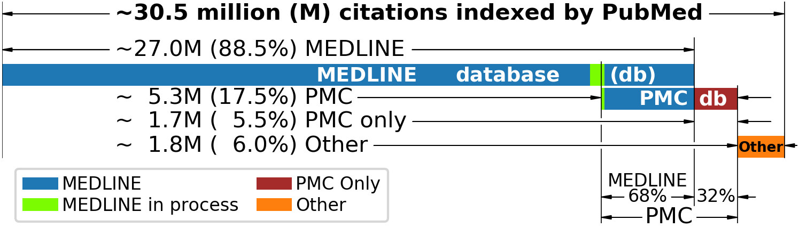

# **PubMed ID (PMID) Cite**

[](https://twitter.com/intent/tweet?text=Python%20library%20to%20download%20pubmed%20citation%20counts%20and%20data,%20given%20a%20PMID&url=https://github.com/dvklopfenstein/pmidcite&via=dvklopfenstein&hashtags=pubmed,pmid,citations,pubmed2cite,writingtips,scientificwriting)
[](https://github.com/dvklopfenstein/pmidcite/actions/workflows/build.yml)
[](https://github.com/dvklopfenstein/pmidcite/actions/workflows/codeql-analysis.yml)
[](https://pypi.org/project/pmidcite/)
[](https://doi.org/10.5281/zenodo.5172712)

<p align="center"></p>

Augment a [**PubMed**](https://pubmed.ncbi.nlm.nih.gov) literature search by linking 
citation data from the [**NIH**](https://icite.od.nih.gov)
with [**PubMed**](https://pubmed.ncbi.nlm.nih.gov) IDs (PMIDs)
using the command line.

This open-source project is part of [**a**](https://pubmed.ncbi.nlm.nih.gov/33031632) [**paper**](https://onlinelibrary.wiley.com/doi/10.1002/jrsm.1456) published in [***Research Synthesis Methods***](https://onlinelibrary.wiley.com/journal/17592887)    

## Usage
* [**Download citation counts and data for a research paper**](https://github.com/dvklopfenstein/pmidcite#download-citation-counts-and-data-for-a-research-paper)
* [**Forward citation search**](https://github.com/dvklopfenstein/pmidcite#forward-citation-search): following a paper's *Cited by* links or *Forward snowballing*
* [**Backward citation search**](https://github.com/dvklopfenstein/pmidcite#backward-citation-search): following the links to a paper's references or *Backward snowballing*

## Download citation data for a research paper
```$ icite -H 26032263```    
* This paper (PMID 26032263) has `25` citations, `10` references, and `4` authors.    
* This paper is performing well (`74`th percentile) compared to its peers.    
    

### NIH percentile
This paper is performing well (`74`th percentile in column `%`) compared to its [peers](https://icite.od.nih.gov/user_guide?page_id=ug_overview).     

The NIH percentile grouping (column `G`) helps to
highlight the better performing papers in groups `2`, `3`, and `4` by
sorting the citing papers by group first, then publication year.

The sort places the lower performing papers in groups `0` or `1` at the back.

New papers appear at the beginning of a sorted list,
no matter how many citations they have to
better facilitate researchers in finding the latest discoveries.

The grouping of papers by NIH percentile grouping is a novel feature created by [dvklopfenstein](https://github.com/dvklopfenstein) for this project.


## Forward citation search
Also known as following a paper's *Cited by* links or *Forward snowballing*    

```icite -H; icite 26032263 --load_citations | sort -k6 -r```    
or    
```icite -H; icite 26032263 -c | sort -k6 -r```    

## Backward citation search
Also known as following links to a paper's references or *Backward snowballing*    

```$ icite -H; icite 26032263 --load_references | sort -k6 -r```    
or    
```$ icite -H; icite 26032263 -r | sort -k6 -r```     

## PubMed vs Google Scholar
<p align="center">

</p>

In 2013, Boeker et al. recommended that a scientific search interface contain five integrated search criteria. 
PubMed implements all five, while Google did not in 2013 or today.

Google's highly popular implementation of the forward citation search through their ubiquitous "Cited by N" links
is a "Better" experience than the PubMed's "forward citation search" implementation.

But if your research is in the health sciences and
you are amenable to consider working from the [command line](#command-line-interface-cli),
you can use PubMed in your browser plus
citation data downloaded from the NIH using the command-line  using *pmidcite*.
The NIH's citation data includes a paper's ranking among its co-citation network.


## What is in [**PubMed**](https://pubmed.ncbi.nlm.nih.gov)?  Take a [**quick tour**](https://www.nlm.nih.gov/pubs/techbull/ma20/brief/ma20_pubmed_essentials.html)


PubMed is a search interface and toolset used to access over 30.5 million article records from databases like:
* **MEDLINE**: a highly selective database started in the 1960s
* **PubMed Central (PMC)**: an open-access database for full-text papers that are free of cost
* Additional content like books and articles published before the 1960s

## Usage details

### Download citations for all papers returned from a PubMed search
Make a copy of `src/bin/dnld_pmids.py` and add your PubMed search to the end of the `queries` list.

There are two PubMed searches in this example:
  * `systematic review AND "how to"[TI]`
  * `Orcinus Orca Type D`

The PubMed search results are saved to specified filenames such as `systematic_review.txt` to be grepped and sorted.
```
def main():
    """Download PMIDs returned for a PubMed query. Write an iCite report for each PMID"""
    queries = [
        # Output filenames               PubMed query
        # -----------------              -----------------------------------
        ('systematic_review.txt',        'systematic review AND "how to"[TI]'),
        ('rarely_seen_killer_whale.txt', 'Orcinus Orca Type D'),
    ]

    obj = PubMedQueryToICite(force_dnld=True)
    dnld_idx = obj.get_index(sys.argv)
    obj.run(queries, dnld_idx)
```

To have better access to PubMed search results, 
get n NCBI API key using these instuctions:    
https://ncbiinsights.ncbi.nlm.nih.gov/2017/11/02/new-api-keys-for-the-e-utilities

## Installation
To install from [**PyPI**](https://pypi.org/project/pmidcite/)    
```pip install pmidcite```

# Contact
dvklopfenstein@protonmail.com    
https://orcid.org/0000-0003-0161-7603

## How to Cite
_If you use **pmidcite** in your research, please cite paper 1 (pmidcite) and paper 3 (NIH citation data)._      

_Please also consider reading and citing Gusenbauer's response (paper 2) about improving search for all during the information avalanche of these times:_

1. [**Commentary to Gusenbauer and Haddaway 2020: Evaluating Retrieval Qualities of PubMed and Google Scholar**](http://dx.doi.org/10.1002/jrsm.1456)    
Klopfenstein DV and Dampier W    
2020 | _Research Synthesis Methods_ | PMID: [33031632](https://pubmed.ncbi.nlm.nih.gov/33031632/) | DOI: [10.1002/jrsm.1456](http://dx.doi.org/10.1002/jrsm.1456) | [pdf](/doc/paper/JRSM_1456_iCite_main.pdf)

2. **Gusenbauer's response:**    
[**What every Researcher should know about Searching – Clarified Concepts, Search Advice, and an Agenda to improve Finding in Academia**](https://onlinelibrary.wiley.com/doi/10.1002/jrsm.1457)    
Gusenbauer M and Haddaway N    
2020 | _Research Synthesis Methods_ | PMID: [33031639](https://pubmed.ncbi.nlm.nih.gov/33031639/) | DOI: [10.1002/jrsm.1457](https://onlinelibrary.wiley.com/doi/10.1002/jrsm.1457) | [pdf](/doc/paper/jrsm.1457.pdf)

3. **The NIH citation data used by *pmidcite* -- Scientific Influence, Translation, and Citation counts:**     
[**The NIH Open Citation Collection: A public access, broad coverage resource**](https://pubmed.ncbi.nlm.nih.gov/31600197/)    
Hutchins BI ... Santangelo GM    
2019 | _PLoS Biology_ | PMID: [31600197](https://pubmed.ncbi.nlm.nih.gov/31600197) | DOI: [10.1371/journal.pbio.3000385](https://journals.plos.org/plosbiology/article?id=10.1371/journal.pbio.3000385)    

## References

_Please consider reading and citing the paper [4] which inspired the creation of **pmidcite** [1] and the authors' response to our paper [2]_:

4. [**Which Academic Search Systems are Suitable for Systematic Reviews or Meta-Analyses? Evaluating Retrieval Qualities of Google Scholar, PubMed and 26 other Resources**](https://pubmed.ncbi.nlm.nih.gov/31614060/)    
Gusenbauer M and Haddaway N    
2019 | _Research Synthesis Methods_ | PMID: [31614060](https://pubmed.ncbi.nlm.nih.gov/31614060) | DOI: [10.1002/jrsm.1378](https://onlinelibrary.wiley.com/doi/full/10.1002/jrsm.1378)

_Mentioned in this README are also these outstanding contributions_:

5. [**Relative Citation Ratio (RCR): A New Metric That Uses Citation Rates to Measure Influence at the Article Level**](https://pubmed.ncbi.nlm.nih.gov/27599104/)    
Hutchins BI, Xin Yuan, Anderson JM, and Santangelo, George M.    
2016 | _PLoS Biology_ | PMID: [27599104](https://pubmed.ncbi.nlm.nih.gov/27599104) | DOI: [10.1371/journal.pbio.1002541](https://journals.plos.org/plosbiology/article?id=10.1371/journal.pbio.1002541)

6. [**Google Scholar as replacement for systematic literature searches: good relative recall and precision are not enough**](https://pubmed.ncbi.nlm.nih.gov/24160679/)    
Boeker M et al.    
2013 | BMC Medical Research Methodology | PMID: [24160679](https://pubmed.ncbi.nlm.nih.gov/24160679) | DOI: [10.1186/1471-2288-13-131](https://bmcmedresmethodol.biomedcentral.com/articles/10.1186/1471-2288-13-131)

7. [**Best Match: New relevance search for PubMed**](https://pubmed.ncbi.nlm.nih.gov/30153250/)    
Fiorini N ... Lu Zhiyong    
2018 | PLoS Biology | PMID: [30153250](https://pubmed.ncbi.nlm.nih.gov/30153250) | DOI: [10.1371/journal.pbio.2005343](https://journals.plos.org/plosbiology/article?id=10.1371/journal.pbio.2005343)    

## [PDFs](/doc/paper/JRSM_1456_iCite_main.pdf)
  * [**PMIDCITE Manuscript**](/doc/paper/JRSM_1456_iCite_main.pdf) with the original text box formatting
    * **Supplemental Material**
      * [S1. *pmidcite* information](/doc/paper/JRSM_1456_iCite_supp1_CitedByN.pdf)
      * [S2. Contents of PubMed](/doc/paper/JRSM_1456_iCite_supp2_PMcontents.pdf)
      * [S3. Screen shots Google Scholar taken Jan 2020](/doc/paper/JRSM_1456_iCite_supp3_GS.pdf)
  * [**Gusenbauer's Response**](/doc/paper/jrsm.1457.pdf)

## Contact
dvklopfenstein@protonmail.com    
https://orcid.org/0000-0003-0161-7603

Copyright (C) 2019-present [pmidcite](https://dvklopfenstein.github.io/pmidcite/), DV Klopfenstein. All rights reserved.

<!--
  Title: PubMed ID (PMID) Cite
  Description: Augment your PubMed literature search with forward/backward citation chaining (snowballing) using NIH citation counts and data
  Author: dvklopfenstein
  -->
<meta name='keywords' content='PMID To citation counts, PMID Citation count, PubMed Citations, pmid2cite, pubmed2cite, citation count, CitedBy, PubMed, PubMed id, PMID, forward citation, backward citation, forward snowball, backward snowball, literature review, citation downloader'>
